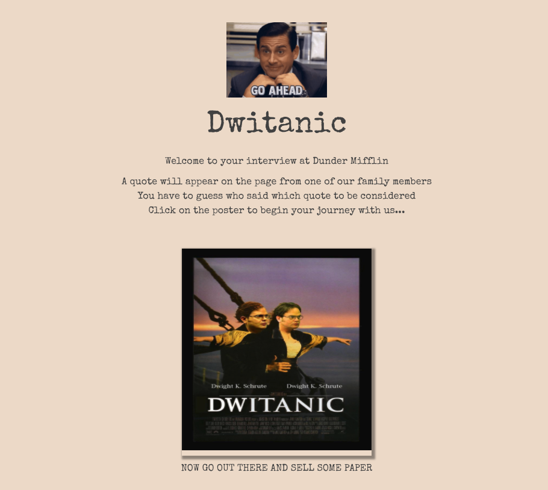
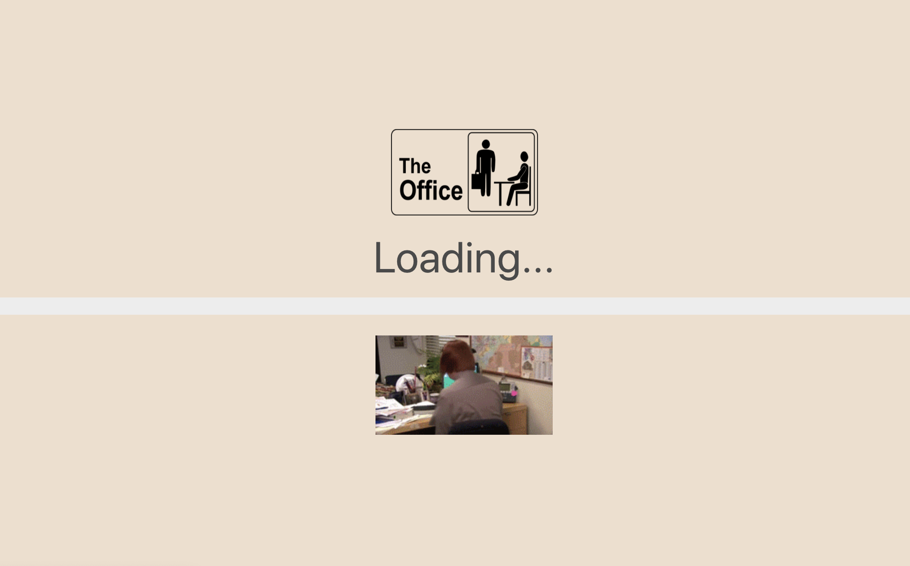
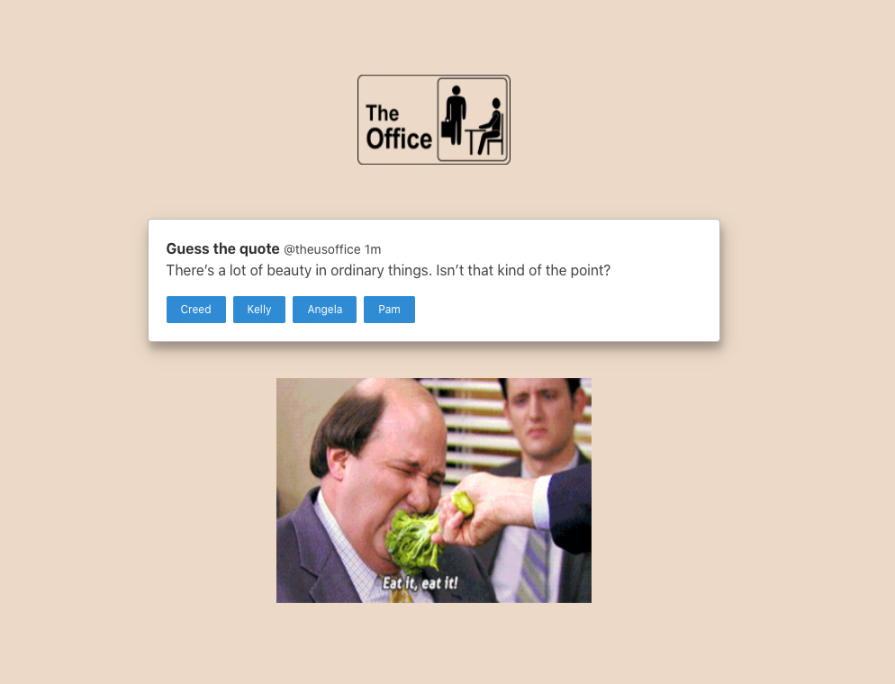
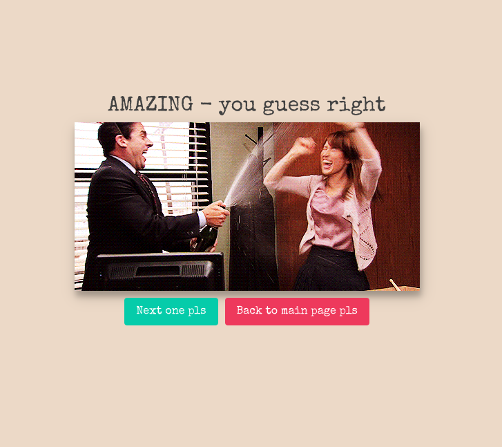
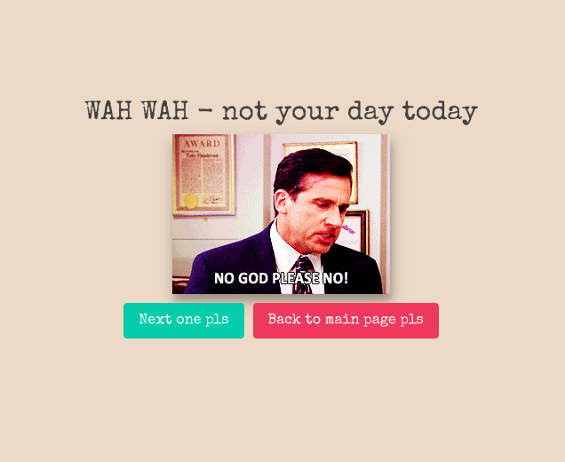

# Project 2: Reactathon - Dwitanic

### Overview
Dwightanic is a 'game' which generates a random quote from a US Office character, and you have to guess who said it out of 4 options. The brief was to use a third party API of our choice, mount the data onto a react app and somehow have the user interact with it.
This was my second project in General Assembly's Software Engineering Immersive Course. It was a pair project assigned after 1 and a half weeks of learning ReactJS and 5 and a half weeks of learning in general.

## My Game
You can find the hosted version of the app here: https://the-us-office-hof.netlify.app/

## Timeframe and Technologies
48 hours, hackathon style and pair coded.

Technologies:
- ReactJS
- Javascript
- Axios
- Insomnia
- 3rd party API
- GitHub
- Bulma

## Game Instructions
1. The game becings with an opening page detailing the instructions of how to play. When you click on the Dwitanic poster it will take you to the game itself.

2. The API was sometimes slow, so implemented our own loading spinner

3. The game begins. A randomly generated quote will appear and the player has to guess who said it out of the 4 options.

4. Depending on whether the player got the anser right they will be given a win or loose page. On this page you are given the option to either play again, or go back to the start page

 

## Process
The first step was making sure the API we chose was interactive and simple to use, we checked the API in insomnia in order to become familiar with the data. We did our initial installs of ReactJS and other dependencies we knew we would need e.g. Axios.

We decided to build 2 simple React components. One App.JS and another component where we would do our first data request. Once we saw the data working and mounted, being the quotes, we then went about mounting the person who said it onto the page. Next up came generating 3 other random characters from the API to produce what looked like 4 options.

Once this was complete we styled the page and added some feautres to enhance the UX. This included an outcome page - which would change depending on whether you won or not, a loading spinner (with a really fun gif) and general tidy up.

## Challenges
One of the biggest challenges was generating 3 random names which weren't the same as the name of the person who actually said the quote as it would give away the answer!

## Future Features
- Adding another API to it for another sitcom
- Having the button with the character who said the quote to mix in with the others - at the moment I will always know the answer as I know which button says it!
- Responsive - as it stands it isn't user friendly on mobile
